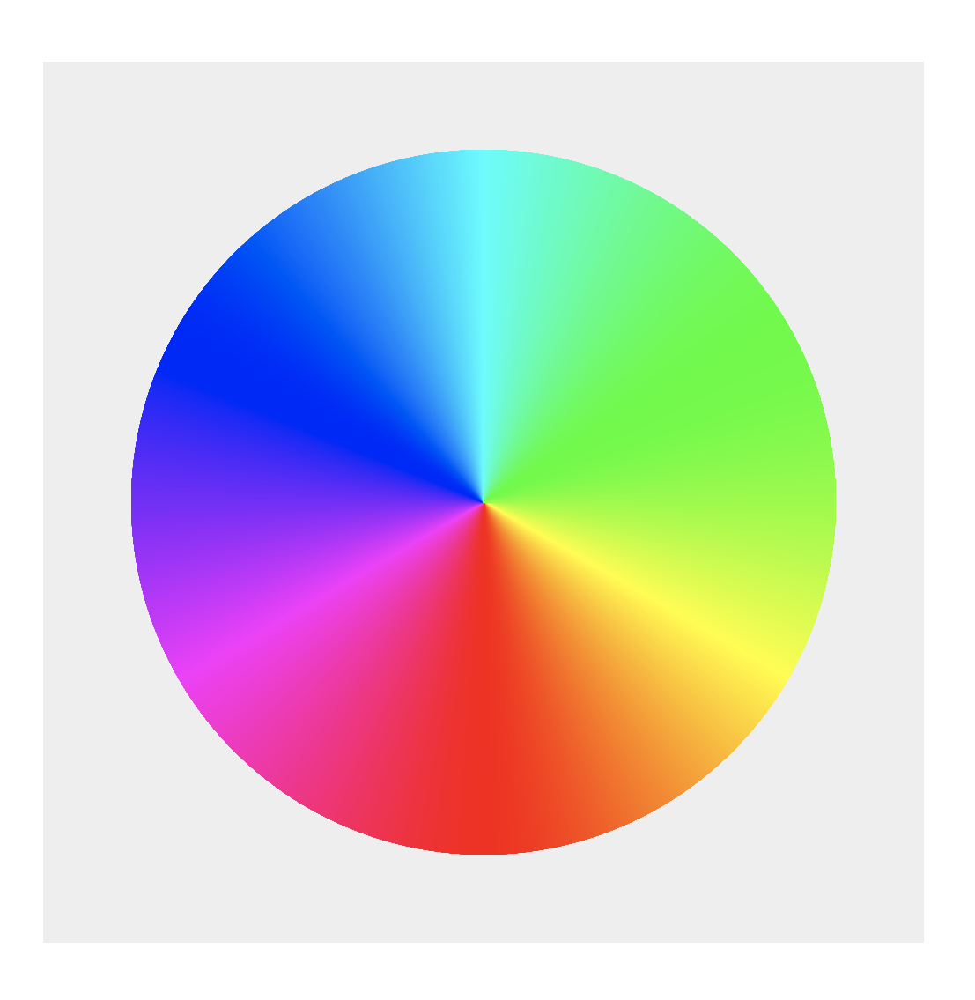

# ColorWheel

Starting from 12 hardcoded colours, this library generates 12288 colours (one for every 1/3 deg on the color wheel). The user can then request random pairings of 1 to 5 colours that look nice together!

# How to Use

1. With a `script tag`

```html
<script src="path/to/ColorWheel.js"></script>

<script>
    const cw = new ColorWheel();
    const colorList = cw.getColors(4);
    colorList = colorList.map(c => cw.lighten(c, 0.3));
    console.log(colorList);
</script>
```

2. With a `require statement`

```js
const ColorWheel = require("path/to/ColorWheel.js");
const cw = new ColorWheel();
const colorList = cw.getColors(4);
colorList = colorList.map(c => cw.darken(c, 0.3));
console.log(colorList);
```

# How Nice Colours are Calculated

This video shows how nice color combinations can be extracted from a color wheel: https://youtu.be/_2LLXnUdUIc?t=143

This library uses: Complementary, Triadic, and Tetradic

# Screenshot

[](https://strawstack.github.io/ColorWheel/)

# Live Demo

[View the Live Demo](https://strawstack.github.io/ColorWheel/)

# Accessing the Wheel

This is how you can get access to all the colors in the wheel and translate between angles and colors.

```js
const ColorWheel = require("path/to/ColorWheel.js");
const cw = new ColorWheel();
const all_colors = cw.colors; // List of 12k elements of type [angle, Color] where angle is 0 to 360

const randomColor = cw.getColors(1)[0];
const angle = cw.angleFromColor(randomColor);
const newAngle = angle + 100;
const color = cw.colorFromAngle(newAngle);
```

# Todo

- [x] Make a color wheel to verify that stuff looks correct
    - [x] Generate colors list with node from test.js
    - [x] Pre-build canvas html/js file that uses list
    - [x] Create circles of lines from centre to edge
    - [x] Should roughly look like a color wheel
